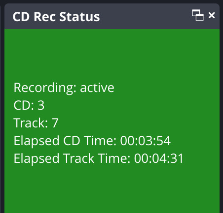

# CD Rec status

An [OBS](https://github.com/obsproject/obs-studio) plugin to display the status of an ongoing cd recording as a dock.



The [offical obs plugin template](https://github.com/obsproject/obs-plugintemplate) was used to create this plugin.

## How it works

This plugin listens in on a WebSocket server on `ws://localhost:8765` from which it receives messages like:
```json
{
  "recording": true,
  "cd": 3,
  "track": 7,
  "cd_time": "00:12:03",
  "track_time": "00:01:26"
}
```
It then adds a dock on the obs studio interface titled *CD Rec Status* that displays the state of the (ongoing) cd recording.


## Building
- checkout the [obs studio](https://github.com/obsproject/obs-studio) repository
- `cd UI/frontend-plugins`
- run `git clone https://github.com/noahvogt/obs-cd-rec-status.git cd-rec-status`
- add the following line to the `CMakeLists.txt` file: `add_subdirectory(cd-rec-status)`
- follow the [offical obs build instructions](https://github.com/obsproject/obs-studio/wiki/Install-Instructions#building-obs-studio) for your prefered platform

You now have compiled OBS with the plugin. But you probably don't want to rebuild obs after every new release. So just find the `cd-rec-status.so` file in the build directory and put it into a plugin directory you can point your regular obs installation to. If you are unsure on how to structure the plugin directory, have a look at the releases on this github repository.
